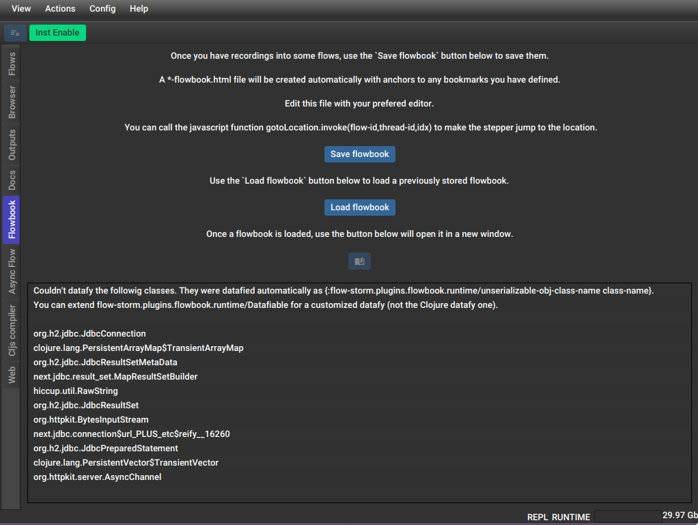

# FlowStorm flowbook plugin




The flowbook plugin allows you to store and replay your flows with an optional "flowbook", which
is a notebook that supports links to your recordings you can use to explain a flow.

**Note: this is still in a experimental phase!**
**Requires FlowStorm >= 4.4.0**

# Setup

In your deps.edn (same can be done with lein profiles) create an alias like 

```clojure
{...
 :aliases
 {...
  :fs-flowbook-plugin
  {:extra-deps {com.github.flow-storm/flow-storm-flowbook-plugin {:mvn/version "1.0.0-alpha"}} ;; check for the latest here
   :jvm-opts ["-Dflowstorm.plugins.namespaces.flowbookPlugin=flow-storm.plugins.flowbook.all"]}}}
```
[](https://clojars.org/com.github.flow-storm/flow-storm-flowbook-plugin) 

Then, in your projects, just make sure you start your repl with the `:fs-flowbook-plugin` alias.

# Usage

## Saving flows

Saving your flows is pretty straight forward. Go to the `Flowbook` plugin tab and click `Save flowbook`. 
A dialog should popup asking for a .edn file to save it in. You don't need it but it is probably better to 
create a folder per flowbook, since saving will create more than one file.

For saving the flows, this plugin needs to serialize all your values, which is not always possible, so
check out the next section for the current strategy.

Let's say you are saving your flows in my-flows.edn, the action of saving the flowbook will create :

    - the main my-flows.edn file which points to the rest of the files
    - my-flows-values.ser, a serialization of all the values involved in the flows
    - my-flows-forms.ser, a serialization of all the source code forms needed
    - my-flows-flowbook.html, which is the notebook you can edit
    - for each thread(timeline) my-flows-flow-[FLOW_ID]-thread[THREAD_ID]-timeline.ser, containing the tracing
    - [optionally] a my-flows-flow-[FLOW_ID]-total-order-timeline.ser per flow if your flows contain one.
    
All your bookmarks will also be saved. If there are any bookmarks, anchors will be automatically added to the 
my-flows-flowbook.html file.

When serialization is done you will get a report of all the classes that couldn't be serialized, so if you are interested,
you can extend datafy on them.

### Serialization

The current value serialization strategy is to datafy everything and only store value representations made of clojure data.
For this, it will pre-walk all values, calling datafy recursively. If datafy returns clojure data, it will be used, if not
a placeholder (a clojure map) with the object-id and class-name will take its place.

You can extend datafy by extending the `flow-storm.plugins.flowbook.runtime/Datafiable`. Notice this is not the 
`clojure.core.protocols/Datafiable`, the reason behind this being, in some cases the Clojure one is probably already being used on other applications 
with a different, maybe conflicting purpose. If that is not the case, you can extend the plugin's Datafiable to just call the Clojure's one.

## Creating a flowbook

A flowbook is a regular `.html` file you can edit to describe/explain your flows. The only special thing about it is that you
can call `gotoLocation.invoke(FLOW_ID,THREAD_ID,IDX)` to make FlowStorm jump to that point in time if it is being rendered
inside the flowbook viewer.

You can work with your file using your browser, or you can open it with the plugin which has a refresh mechanism (see next section).

## Replaying flows and loading a flowbook

Replaying your flows is straight forward. Head to the `Flowbooks` plugin tab and click on `Load flowbook`. It
should bring up a file selector for .edn files. After selecting your flowbook, it should replay them, and enable
a button that allows you to open the flowbook visualizer.

Since the serialized values are just clojure data, your flows should be
able to replay in any runtime, just needing FlowStorm and the Flowbook plugin as dependencies.

## Examples

There is a flowbook example [here](example-flowbooks/) if you want to try.
If you are going to try it, it is also recommended to run with the [web plugin](https://github.com/flow-storm/flow-storm-web-plugin).

