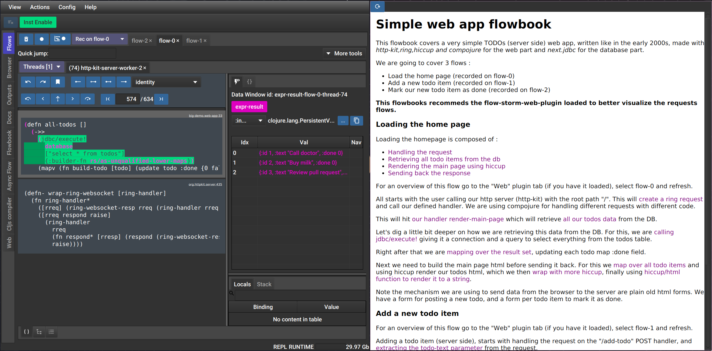

# FlowStorm flowbook plugin




The flowbook plugin allows you to store and replay your flows with an optional "flowbook" which
is a notebook but linked to your recordings, which you can use to explain a flow.

**Note: this is still in a experimental phase!**
**Requires FlowStorm >= 4.4.0**

# Setup

Add [](https://clojars.org/com.github.flow-storm/flow-storm-flowbook-plugin) 
to your dependencies.

Then add the following to your JVM opts so the plugin gets loaded automatically when the FlowStorm UI loads  :


```clojure
"-Dflowstorm.plugins.namespaces=flow-storm.plugins.flowbook.all"
```

# Usage

## Saving flows

### Serialization

## Creating a flowbook

## Replaying flows and loading the flowbook

